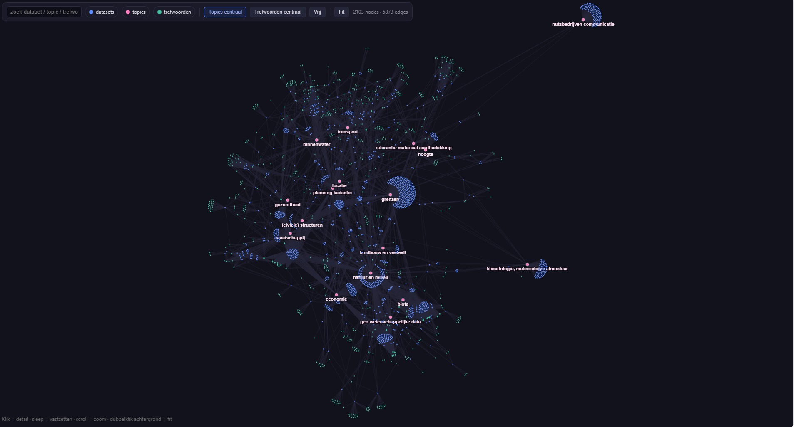

# PZH metadata — kennisgraaf

Tooling om metadata van de Provincie Zuid-Holland op te halen, te analyseren en als interactieve graph te visualiseren.

## Achtergrond

### Wat is metadata en waarom een graph?

Elke geodataset die de provincie publiceert heeft een **metadatarecord**: een standaard beschrijving met titel, samenvatting, datum, contactgegevens en trefwoorden. Die records zijn opgeslagen in een **GeoNetwork-catalogus** en opvraagbaar via een CSW-endpoint (Catalogue Service for the Web) — een OGC-standaard voor het doorzoeken van geo-catalogussen.

De metadata volgt de **ISO 19115/19139-standaard**. Die standaard schrijft voor welke velden er zijn en in welk XML-formaat ze worden opgeslagen. Twee velden zijn hier het meest relevant:

- **`topicCategory`** — één of meer ISO-onderwerpscategorieën, gekozen uit een vaste lijst van 19 codes (bijv. `environment`, `boundaries`, `transportation`). Elke dataset heeft er minstens één.
- **`MD_Keywords`** — vrije trefwoorden, eventueel gekoppeld aan een thesaurus. De Provincie gebruikt onder andere de *Interprovinciale thesaurus*, een gedeelde woordenlijst van provincies.

Een graph brengt al die losse records samen: datasets worden knopen, en gedeelde onderwerpen of trefwoorden worden verbindingen. Zo zie je in één oogopslag welke datasets inhoudelijk bij elkaar horen, en welke thema's dominant zijn.

---

## Hoe werkt het?

### Stap 1 — Ophalen van de metadata

Het script `build_graph.py` haalt alle records op via het CSW-endpoint van het [Open Data Portaal Zuid-Holland](https://opendata.Zuid-Holland.nl/):

```
GET /geonetwork/srv/dut/csw
  ?SERVICE=CSW&VERSION=2.0.2&REQUEST=GetRecords
  &outputSchema=http://www.isotc211.org/2005/gmd
  &startPosition=1&maxRecords=50
```

Per pagina van 50 records wordt de ruwe ISO 19139 XML opgeslagen in `bronze_xml/{uuid}.xml`. Bij een volgende run worden al gecachede UUIDs overgeslagen — je kunt dus gewoon opnieuw draaien zonder alles opnieuw op te halen.

Van de ~2283 records op het portaal zijn er **1427 bruikbaar als dataset-metadata**. De overige ~856 zijn *feature catalogues* (ISO 19110) — beschrijvingen van attributen in plaats van datasets. Die worden automatisch overgeslagen.

### Stap 2 — Uitlezen van de XML

De functie `extract()` leest per record de relevante velden uit de ISO-XML:

| Veld | XML-pad | Waarvoor |
|------|---------|----------|
| UUID | `gmd:fileIdentifier` | Unieke identifier, ook als bestandsnaam in de cache |
| Titel | `gmd:identificationInfo//gmd:title` | Label van het dataset-knoop |
| Samenvatting | `gmd:identificationInfo//gmd:abstract` | Toelichting in het detailpanel |
| Datum | `gmd:dateStamp` | Wanneer bijgewerkt |
| Topic categories | `gmd:topicCategory/gmd:MD_TopicCategoryCode` | Backbone van de graph |
| Interprov. trefwoorden | `gmd:MD_Keywords` met thesaurusnaam `"Interprovinciale"` | Derde knooptype in de graph |

### Stap 3 — Bouwen van de graph

De graph heeft **drie knooptypes**:

```
[dataset]  ──────  [topic]
    │
    └──────────────  [trefwoord]
```

| Knooptype | Kleur | Vorm | Betekenis |
|-----------|-------|------|-----------|
| Dataset | blauw | cirkel | één metadatarecord |
| Topic | roze | hexagoon | ISO-onderwerpscategorie (17 uniek) |
| Trefwoord | groen | ruit | Interprovinciale thesaurus-term |

Een kant tussen dataset en topic betekent: *deze dataset valt onder dit onderwerp*. Een kant tussen dataset en trefwoord betekent: *dit trefwoord is aan deze dataset gekoppeld*.

Naast de hoofdgraph worden ook twee projecties berekend:
- **Dataset–dataset** (gewicht = aantal gedeelde topics): clusters van inhoudelijk verwante datasets
- **Topic–topic** (gewicht = aantal datasets dat beide topics deelt): co-occurrentie van onderwerpen

---

## Installatie en gebruik

**Vereist:** Python 3.10+ (getest op 3.13).

```bash
pip install -r requirements.txt
```

> De commando's hieronder gebruiken `py`, de Python-launcher op Windows. Op macOS/Linux gebruik je `python` of `python3`.

```bash
# Volledig ophalen (~1427 datasets):
py build_graph.py --limit 0

# Snelle test met 100 records:
py build_graph.py --limit 100

# Herbouwen vanuit bestaande cache (geen netwerk):
py build_graph.py --xmldir bronze_xml/
```

## Uitvoer

| Bestand | Inhoud |
|---------|--------|
| `graph.html` | Interactieve visualisatie, volledig zelfstandig (~2 MB). Openen in browser, geen installatie nodig. |
| `graph.graphml` | Volledige graph (datasets + topics + trefwoorden) voor Gephi of NetworkX |
| `graph_projectie.graphml` | Dataset–dataset projectie, kantgewicht = gedeelde topics |
| `graph_topics.graphml` | Topic co-occurentiegraph (17 knopen) |

### `graph.html` gebruiken

- **Zoekbalk** linksboven: typ een naam of trefwoord, klik op een resultaat om naar dat knoop te navigeren.
- **Filterchips**: zet knooptypes aan of uit.
- **Hiërarchiemodus**: kies "Topics centraal", "Trefwoorden centraal" of "Vrij" om de layout te sturen.
- **Klik op een knoop**: detailpanel opent rechts met titel, link naar het portaal, samenvatting en buren.
- **Inzoomen / hoveren**: labels verschijnen (Obsidian-stijl).

### Gephi

Sleep een `.graphml`-bestand in [Gephi Lite](https://gephi.org/gephi-lite/). Kleur op `hoofd_topic`, kantdikte op `weight`, layout Force Atlas 2 met hoge Gravity.

---

## Bevindingen (juli 2026, 1427 datasets)

| Bevinding | Waarde |
|-----------|--------|
| Datasets met topicCategory | **100%** — de backbone is compleet |
| Datasets met Interprov. trefwoord | 37% (533 datasets) |
| Unieke trefwoorden | 1.811 |
| Sterkste topic-combinatie | natuur en milieu — economie (160 datasets) |

Slechts 6% van de datasets heeft een URI-gebaseerd keyword waarmee directe koppeling aan SKOS-thesauri (GEMET, INSPIRE) mogelijk is. De ISO-topiccategorie is daarmee de meest bruikbare structuur voor de graph-backbone.

---

## Bestandsstructuur

```
analyse_thesaurus.py     # trefwoord-dekkingsanalyse (uri / in-thes / free-text)
build_graph.py           # harvest + graph-opbouw
build_graph/
  build.py               # GraphML → zelfstandige HTML
  template.html          # viewer-shell (layout, zoek, hiërarchiemodus, detailpanel)
  force-graph.min.js     # gevendorde force-graph bibliotheek (offline bruikbaar)
requirements.txt
```

De `bronze_xml/`-cache is gitignored. Vul die op via `py build_graph.py --limit 0`.

---

## Licentie

[MIT](LICENSE) — vrij te gebruiken, aan te passen en te delen, met behoud van de copyrightvermelding.

Meegeleverde third-party software: zie [THIRD_PARTY.md](THIRD_PARTY.md).
